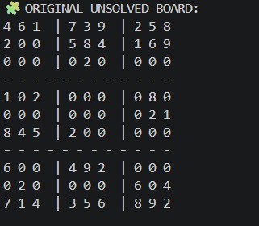
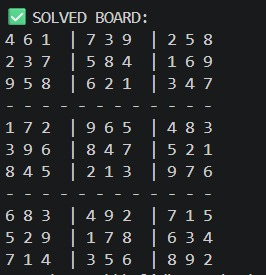

# 🧩 Sudoku Solver

A Python application that solves Sudoku puzzles using the **Backtracking Algorithm**.

This project was built to strengthen my understanding of **Python**, **recursion**, and **algorithmic problem-solving**. The solver automatically fills empty cells while following all Sudoku rules.

---

## 📌 Overview

Sudoku is a logic-based puzzle played on a **9×9 grid**, divided into **nine 3×3 subgrids**.

The objective is to fill every empty cell so that:

- Each row contains the numbers **1–9**
- Each column contains the numbers **1–9**
- Each 3×3 box contains the numbers **1–9**

This solver uses a **recursive backtracking algorithm** to find a valid solution.

---

## 🚀 Features

- ✅ Solves any valid 9×9 Sudoku puzzle
- ✅ Uses the Backtracking Algorithm
- ✅ Finds empty cells automatically
- ✅ Validates every move according to Sudoku rules
- ✅ Displays the original and solved board
- ✅ Beginner-friendly Python code with comments

---

## 🛠 Technologies Used

- Python 3
- Recursion
- Backtracking Algorithm
- Functions
- 2D Lists (Arrays)
- Git
- GitHub

---

## 📂 Project Structure

```
Sudoku-Solver/
│
├── images/
│   ├── unsolved-board.jpg
│   └── solved-board.jpg
│
├── solver.py
├── README.md
└── requirements.txt
```

---

## 🧠 Algorithm

The solver works using the **Backtracking Algorithm**.

### Steps

1. Find the next empty cell.
2. Try numbers **1–9**.
3. Check if the number is valid.
4. If valid, place the number.
5. Recursively solve the remaining puzzle.
6. If no number works, undo the move (Backtrack).
7. Repeat until the puzzle is solved.

---

## ⏱️ Time Complexity

Worst Case:

```
O(9^(n²))
```

Since every empty cell may require trying numbers 1 through 9.

---

## 💾 Space Complexity

```
O(n²)
```

For storing the Sudoku board and recursive function calls.

---

## ⚙️ Installation

Clone the repository:

```bash
git clone https://github.com/khalidh-M/Sudoku-Solver.git
```

Move into the project directory:

```bash
cd Sudoku-Solver
```

Run the program:

```bash
python solver.py
```

---

## 📸 Example Output

### 🧩 Original Sudoku Board



---

### ✅ Solved Sudoku Board



---

## 📚 What I Learned

Through this project, I learned:

- Python programming fundamentals
- Working with 2D lists
- Writing reusable functions
- Recursion
- Backtracking algorithms
- Debugging techniques
- Git and GitHub workflow
- Writing professional project documentation

---

## 💡 Skills Demonstrated

- Python
- Problem Solving
- Algorithms
- Recursion
- Backtracking
- Data Structures
- Git
- GitHub

---

## 🔮 Future Improvements

Some planned enhancements include:

- 🎨 Graphical User Interface (Tkinter)
- 🌐 Web application using Streamlit
- 📂 Read Sudoku puzzles from text files
- 🎲 Random Sudoku Generator
- 📊 Difficulty levels (Easy, Medium, Hard)
- ⚡ Performance optimization
- ✅ Unit testing with pytest

---

## 👨‍💻 Author

**Khalidh Murghay**

GitHub Profile:

**https://github.com/khalidh-M**

---

## ⭐ Support

If you found this project helpful or interesting, consider giving it a ⭐ on GitHub.

Feedback and suggestions are always welcome!